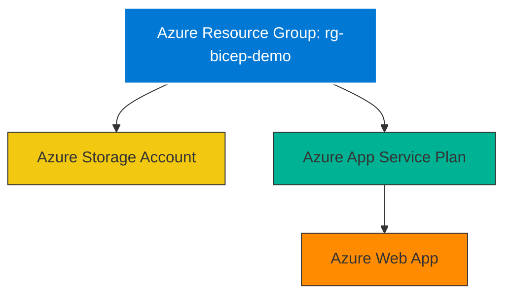

# Azure Bicep Starter – Deploy Web App & Storage Account

## 📌 Overview
This project demonstrates how to use **Azure Bicep** to deploy a simple Azure environment containing:
- **Azure Storage Account** (for static files/backups)
- **Azure App Service Plan**
- **Azure Web App** (publicly accessible)

The entire deployment is automated using **Infrastructure-as-Code**.

---

## 🛠️ Tech Stack
- **Azure Bicep** – IaC for Azure
- **Azure CLI** – Deployment & resource management
- **Azure App Service** – Web hosting
- **Azure Storage** – Object storage
- **Basic App Service Plan** – Hosting tier

---

## 📂 Project Structure

```
azure-bicep-webapp/
│-- main.bicep 
│-- README.md

```
---

## 🖼 Architecture Diagram



🎯 Key Skills Demonstrated

    - Writing Azure Bicep templates
    - Deploying resources with Azure CLI
    - Creating and linking Azure App Service & Storage Account
    - Infrastructure automation best practices


## 📸 Screenshots

### Azure Portal – Deployed Resources
.png)

### Terminal – Successful Deployment
.png)
.png)

### Web App – Live URL
.png)
